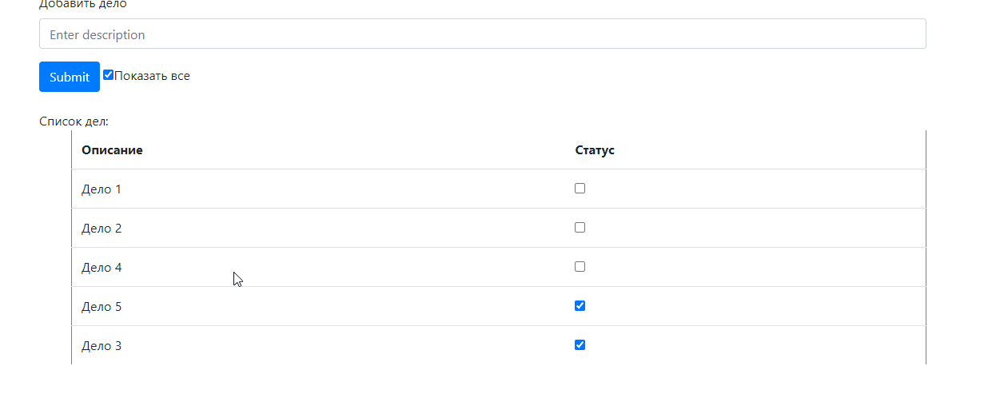
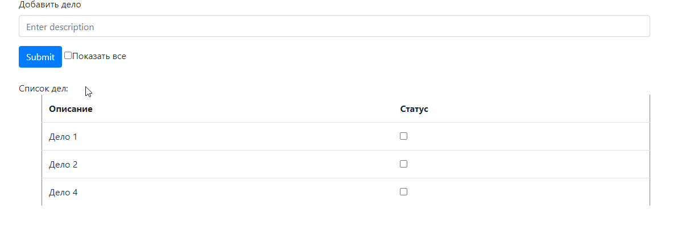

Проект список дел.
Есть возможность добавить дело в список, через форму вводаи кнопку Submit.

При активном парамтре "Показать все", отображаются все задачи.

При выключеном только невыполненные.

Если кликнуть на чекбокс Статуса, значение изменится. (done = true/false)

